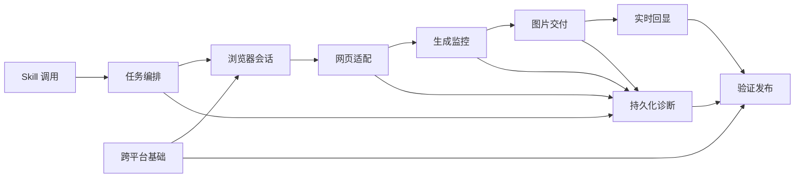

# GPT 网页生图 Skill 架构文档

> 规划架构，不代表代码已存在。最终包名、函数签名和依赖版本在实现阶段通过失败测试确认。

## 技术栈

| 层 | 选型 | 理由 |
|---|---|---|
| Skill | Open Agent Skill 格式：`SKILL.md` + `agents/openai.yaml` + 脚本 | 同时支持隐式与显式调用，适合用户级安装 |
| 运行时 | Node.js + TypeScript | 跨 macOS/Windows，适合长任务、事件流和文件操作 |
| 浏览器控制 | Google Chrome Stable + Playwright | 支持持久化 Profile、语义定位、最小化真实窗口、下载事件和人工接管 |
| 测试 | Node 内置测试运行器 + 可控本地网页夹具 | 减少额外依赖并能确定性覆盖状态机 |
| 图片处理 | `sharp` 候选，待实现时确认 | 需要真实解码、尺寸校验和 PNG 预览；须验证双平台预构建包 |
| 数据 | JSON/JSONL + 本地文件系统 | 便于恢复、流式进度与人工诊断，无需数据库 |
| CI | GitHub Actions `windows-latest` | 覆盖 Windows x64 安装、路径、锁、夹具和契约测试 |

## 规划文件布局

| 路径 | 职责 |
|---|---|
| `.agents/skills/gpt-web-image/` | 可版本化的 Skill 源码与用户级安装源 |
| `src/cli.ts` | `setup/generate/edit/resume/cancel/doctor/cleanup` 命令入口 |
| `src/config/` | 配置、默认值、系统目录和能力检查 |
| `src/browser/` | Chrome 探测、Profile、登录、可视/后台和锁 |
| `src/tasks/` | taskId、队列、取消、数量与目标选择 |
| `src/chatgpt/` | 会话创建、提交确认、回复绑定与语义定位 |
| `src/monitor/` | 状态机、DOM 观察、超时和异常升级 |
| `src/images/` | 发现、下载、校验、去重、预览和目录布局 |
| `src/events/` | JSONL 协议、序号、进度节流和最终核对 |
| `src/persistence/` | task.json、恢复和结果不确定处理 |
| `src/diagnostics/` | 脱敏、Trace、快照和 7 天清理 |
| `tests/fixtures/chatgpt-page/` | 可控网页夹具，模拟成功、失败、改版和超时 |
| `tests/` | 单元、契约、集成和跨平台测试 |

## 一级模块

- **01-Skill调用**：触发、参数解析和歧义确认。
- **02-跨平台基础**：配置、系统路径、Chrome 探测和安装。
- **03-浏览器会话**：Profile、首次登录、后台切换和进程边界。
- **04-任务编排**：任务模型、串行队列、取消、数量和多图选择。
- **05-网页适配**：新会话、提交幂等、回复绑定和语义定位。
- **06-生成监控**：状态机、DOM 活动、多信号判定和异常诊断。
- **07-图片交付**：图片发现、下载、校验、去重和预览。
- **08-实时回显**：JSONL、逐张回显、节流和最终核对。
- **09-持久化诊断**：task.json、恢复、脱敏和安全清理。
- **10-验证发布**：测试夹具、双平台验证和完成门禁。

## 模块关系图

## 核心数据流

1. Codex 选择 Skill，解析任务输入；歧义则停止并返回问题。
2. 任务编排创建 taskId、读取数量默认值并进入串行队列。
3. 浏览器会话获取 Profile 锁，执行能力与登录检查，必要时转可视模式。
4. 网页适配器创建或复用会话，记录基线，提交后绑定用户消息和助手回复。
5. 生成监控器根据 DOM、语义、图片和网络旁证推进状态机。
6. 每个稳定图片交给下载器，校验通过后写入 ImageResult 和 task.json。
7. 事件层输出递增 JSONL `image_ready`；Codex 立即按绝对路径回显。
8. 最终核对目标数量、文件和事件，释放锁并写入终态。

## 故障与恢复流

- 提交不确定：检查绑定用户消息，不存在明确证据时进入 `result_uncertain`，不重复提交。
- 登录或验证：关闭后台上下文，使用同 Profile 启动可视 Chrome，等待用户完成后继续。
- DOM 结构异常：停止坐标操作，生成脱敏快照与 Trace，进入 `structure_changed`。
- 进程中断：恢复命令加载 task.json 与会话 URL，重新建立基线并仅检查未完成结果。
- 下载失败：保留网页生成证据，标记 `download_failed`，不使用截图代替。

## 关键技术决策

| 决策 | 选择 | 备选 | 理由 |
|---|---|---|---|
| 自动化承载 | Skill + 确定性控制脚本 | 纯模型点击 / 本地 MCP | 比纯点击稳定，首版又比常驻 MCP 简单 |
| 浏览器状态 | 独立持久化 Profile | 复用日常 Profile | 隔离账号数据与进程，降低误操作范围 |
| 正常运行 | 真实 Chrome 最小化，异常转可视 | 永远可视 | 保留真实账号网页能力，同时避免任务窗口抢占前台 |
| 结果判断 | 多信号状态机 | 固定延时/单选择器 | 网页变化下更可靠，能表达不确定性 |
| 结果交付 | 下载校验后逐张事件 | 整批完成后统一返回 | 满足实时回显并避免残缺文件 |
| 并发 | 按 Profile 隔离的跨进程持久化 FIFO 队列 | 多标签并发 | 防止多个 Codex Composer 互相覆盖并降低串图风险 |
| 外部接口 | 仅公开页面交互 | 私有网络接口 | 降低脆弱性与安全风险 |

## 安全边界

- 认证数据只存在 Chrome 专用 Profile 或用户主动创建的本机未加密备份；注册表、日志与 task.json 不记录凭据。
- 浏览器资源响应仅作为旁证或读取页面已经暴露的本次图片，不主动调用私有端点。
- 诊断资料写入专用目录并在 7 天后清理；清理前必须校验规范化路径与根目录归属。
- Profile、输出、诊断和本机配置必须加入 Git 忽略范围。

## 本轮新增架构：多 Profile 管理系统

### 组件

| 组件 | 责任 | 规划位置 |
|---|---|---|
| ProfileRegistry | 原子读写默认根目录、历史根目录、Profile 元数据和唯一 activeProfileId | `src/profiles/registry.ts` |
| DirectoryScanner | 只扫描受控根目录和归属标记，发现并校验 Profile | `src/profiles/scanner.ts` |
| DirectorySettings | 校验新默认目录并生成迁移/保留预检结果 | `src/profiles/directories.ts` |
| ProfileMigration | 关闭占用后复制、校验、切换注册表并安全清理源目录 | `src/profiles/migration.ts` |
| ProfileManager | 创建、导入、修改、删除、备份和恢复生命周期 | `src/profiles/manager.ts` |
| MembershipChecker | 基于 ChatGPT 页面语义确认登录和 Plus/Pro/Go | `src/browser/membership.ts` |
| BrowserLease | 全局一个专用 Chrome 进程，区分人工标签页和任务标签页 | `src/browser/browser-lease.ts` |
| LocalManagerServer | 只绑定回环地址，提供 HTML 和 Profile 管理 API | `src/manager/server.ts` |
| ProfileManagerPage | 中文列表、表单、弹框、状态和响应式 UI | `src/manager/public/` |

### 数据与路径

默认根目录位于应用支持目录，注册表不放入仓库。现有 `chrome-profile` 作为兼容 Profile 原地注册。Profile 元数据和 Chrome 内容分离：注册表只保存路径、名称、状态和时间，认证数据只存在对应 Chrome 目录；用户主动备份时才复制到本机未加密归档。外部导入 Profile 必须显式确认，日常 Chrome 默认目录拒绝。

### 运行流

1. 管理服务读取注册表并扫描当前默认根目录。
2. 合法发现项加入注册表，页面展示路径、状态和资格。
3. 创建/导入/修改/删除通过原子注册表操作；删除需要二次确认和无占用前置条件。
4. 修改根目录先生成迁移计划；用户选迁移时复制、校验、切换、清理，选保留时只更新默认创建根目录。
5. 启用前 MembershipChecker 使用同一专用 Chrome 会话确认登录和会员等级。
6. 生图任务在开始时绑定 active Profile；BrowserLease 复用唯一 Chrome 进程并创建独立任务标签页。

### 新增安全不变量

- 自动扫描不越过配置根目录，不跟随未确认的符号链接，不识别日常 Chrome。
- 任一时刻只有一个 active Profile 和一个项目专用 Chrome 进程。
- 迁移失败保留源目录和旧注册表；未知冲突不覆盖。
- 备份是未加密敏感文件，必须本机保存并显式警告，不进入日志或 Git。
- 自动代码路径不存在物理删除 Profile 的权限；只有页面二次确认删除接口可执行。

## 本轮新增架构：图片管理

### 组件与边界

| 组件 | 责任 | 规划位置 |
|---|---|---|
| ImageIndex | 按 Profile 建立本地图片索引、增量更新和缺失标记 | `src/images/manager-index.ts` |
| ImageRecord | 保存图片路径、生成时间、任务、项目、类型、尺寸、格式、大小和状态 | `src/images/manager-model.ts` |
| ImageScanner | 只扫描已选 Profile 的受控输出目录，拒绝越界路径 | `src/images/manager-scanner.ts` |
| ImageQuery | 执行 Profile、时间、项目、任务、类型、格式、尺寸、状态和关键词组合筛选 | `src/images/manager-query.ts` |
| ImagePreview | 提供缩略图、原图、详情、复制路径、打开目录和导出入口 | `src/images/manager-preview.ts` |
| ImageManagerApi | 为本地管理页面提供列表、详情、扫描和错误响应契约 | `src/manager/image-api.ts` |
| ImageManagerPage | 在现有 Profile 控制台中承接图片管理页面和全部 UI 状态 | `src/manager/public/` |

### 数据流

1. 页面先读取 Profile 列表，用户确认单个 Profile 后才创建图片查询上下文。
2. ImageScanner 只读取该 Profile 的输出目录，解析图片文件和已有 TaskRecord，不读取认证目录。
3. ImageIndex 对文件做稳定性、格式、尺寸和路径归属校验，记录缺失/损坏状态而不是使整批列表失败。
4. ImageQuery 在索引层组合筛选、搜索、排序和项目分组，默认生成时间倒序。
5. 页面先加载缩略图，详情预览按需读取原图；大图库使用分页或懒加载。
6. 目录迁移或图片生成完成后触发增量扫描；手动刷新可重建当前 Profile 索引。

### 图片管理安全不变量

- 查询上下文必须包含唯一 `profileId` 和规范化输出根目录，任何跨 Profile 路径都拒绝。
- 不读取或返回 Cookie、Token、密码、验证码、完整认证日志或生产配置。
- 列表阶段不删除图片，不修改原图；损坏和缺失只标记状态。
- 所有路径必须经过根目录归属、符号链接和平台路径校验。
- UI 壳静态数据不能冒充真实索引；真实 API 接线必须等 Stitch 接收和实例级复修通过后进行。
