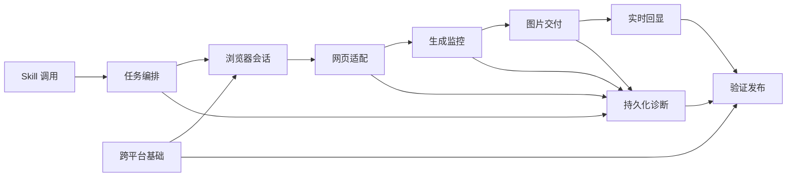

# GPT 网页生图 Skill 架构文档

> 规划架构，不代表代码已存在。最终包名、函数签名和依赖版本在实现阶段通过失败测试确认。

## 技术栈

| 层 | 选型 | 理由 |
|---|---|---|
| Skill | Open Agent Skill 格式：`SKILL.md` + `agents/openai.yaml` + 脚本 | 同时支持隐式与显式调用，适合用户级安装 |
| 运行时 | Node.js + TypeScript | 跨 macOS/Windows，适合长任务、事件流和文件操作 |
| 浏览器控制 | Google Chrome Stable + Playwright | 支持持久化 Profile、语义定位、下载事件和 Headless/Headed 切换 |
| 测试 | Node 内置测试运行器 + 可控本地网页夹具 | 减少额外依赖并能确定性覆盖状态机 |
| 图片处理 | `sharp` 候选，待实现时确认 | 需要真实解码、尺寸校验和 PNG 预览；须验证双平台预构建包 |
| 数据 | JSON/JSONL + 本地文件系统 | 便于恢复、流式进度与人工诊断，无需数据库 |
| CI | GitHub Actions `windows-latest` | 覆盖 Windows x64 安装、路径、锁、夹具和契约测试 |

## 规划文件布局

| 路径 | 职责 |
|---|---|
| `.agents/skills/gpt-web-image/` | 可版本化的 Skill 源码与用户级安装源 |
| `src/cli.ts` | `setup/generate/edit/resume/cancel/doctor/cleanup` 命令入口 |
| `src/config/` | 配置、默认值、系统目录和能力检查 |
| `src/browser/` | Chrome 探测、Profile、登录、可视/后台和锁 |
| `src/tasks/` | taskId、队列、取消、数量与目标选择 |
| `src/chatgpt/` | 会话创建、提交确认、回复绑定与语义定位 |
| `src/monitor/` | 状态机、DOM 观察、超时和异常升级 |
| `src/images/` | 发现、下载、校验、去重、预览和目录布局 |
| `src/events/` | JSONL 协议、序号、进度节流和最终核对 |
| `src/persistence/` | task.json、恢复和结果不确定处理 |
| `src/diagnostics/` | 脱敏、Trace、快照和 7 天清理 |
| `tests/fixtures/chatgpt-page/` | 可控网页夹具，模拟成功、失败、改版和超时 |
| `tests/` | 单元、契约、集成和跨平台测试 |

## 一级模块

- **01-Skill调用**：触发、参数解析和歧义确认。
- **02-跨平台基础**：配置、系统路径、Chrome 探测和安装。
- **03-浏览器会话**：Profile、首次登录、后台切换和进程边界。
- **04-任务编排**：任务模型、串行队列、取消、数量和多图选择。
- **05-网页适配**：新会话、提交幂等、回复绑定和语义定位。
- **06-生成监控**：状态机、DOM 活动、多信号判定和异常诊断。
- **07-图片交付**：图片发现、下载、校验、去重和预览。
- **08-实时回显**：JSONL、逐张回显、节流和最终核对。
- **09-持久化诊断**：task.json、恢复、脱敏和安全清理。
- **10-验证发布**：测试夹具、双平台验证和完成门禁。

## 模块关系图

## 核心数据流

1. Codex 选择 Skill，解析任务输入；歧义则停止并返回问题。
2. 任务编排创建 taskId、读取数量默认值并进入串行队列。
3. 浏览器会话获取 Profile 锁，执行能力与登录检查，必要时转可视模式。
4. 网页适配器创建或复用会话，记录基线，提交后绑定用户消息和助手回复。
5. 生成监控器根据 DOM、语义、图片和网络旁证推进状态机。
6. 每个稳定图片交给下载器，校验通过后写入 ImageResult 和 task.json。
7. 事件层输出递增 JSONL `image_ready`；Codex 立即按绝对路径回显。
8. 最终核对目标数量、文件和事件，释放锁并写入终态。

## 故障与恢复流

- 提交不确定：检查绑定用户消息，不存在明确证据时进入 `result_uncertain`，不重复提交。
- 登录或验证：关闭后台上下文，使用同 Profile 启动可视 Chrome，等待用户完成后继续。
- DOM 结构异常：停止坐标操作，生成脱敏快照与 Trace，进入 `structure_changed`。
- 进程中断：恢复命令加载 task.json 与会话 URL，重新建立基线并仅检查未完成结果。
- 下载失败：保留网页生成证据，标记 `download_failed`，不使用截图代替。

## 关键技术决策

| 决策 | 选择 | 备选 | 理由 |
|---|---|---|---|
| 自动化承载 | Skill + 确定性控制脚本 | 纯模型点击 / 本地 MCP | 比纯点击稳定，首版又比常驻 MCP 简单 |
| 浏览器状态 | 独立持久化 Profile | 复用日常 Profile | 隔离账号数据与进程，降低误操作范围 |
| 正常运行 | Headless，异常转 Headed | 永远可视 | 满足后台使用，同时保留人工验证入口 |
| 结果判断 | 多信号状态机 | 固定延时/单选择器 | 网页变化下更可靠，能表达不确定性 |
| 结果交付 | 下载校验后逐张事件 | 整批完成后统一返回 | 满足实时回显并避免残缺文件 |
| 并发 | 单 Profile 串行队列 | 多标签并发 | 降低串图、锁冲突和账号限额风险 |
| 外部接口 | 仅公开页面交互 | 私有网络接口 | 降低脆弱性与安全风险 |

## 安全边界

- 认证数据只存在 Chrome 专用 Profile；日志与 task.json 不记录凭据。
- 浏览器资源响应仅作为旁证或读取页面已经暴露的本次图片，不主动调用私有端点。
- 诊断资料写入专用目录并在 7 天后清理；清理前必须校验规范化路径与根目录归属。
- Profile、输出、诊断和本机配置必须加入 Git 忽略范围。
